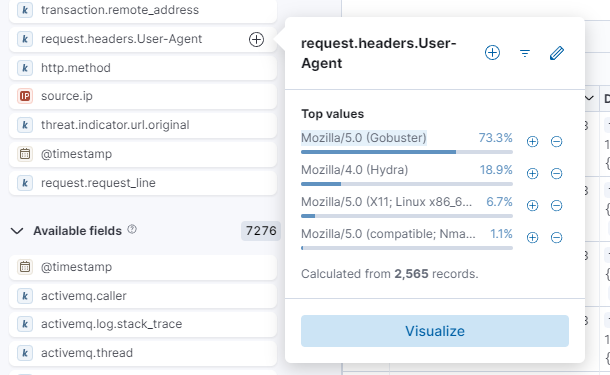
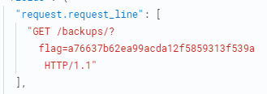
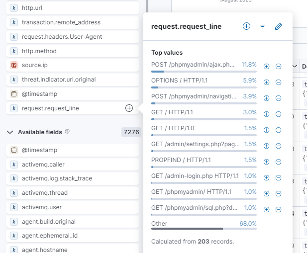
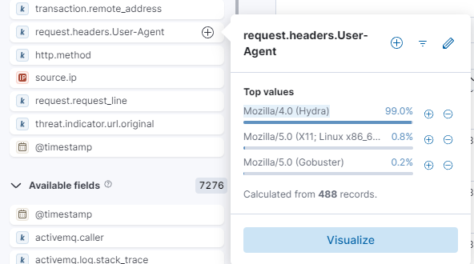
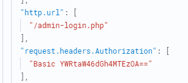
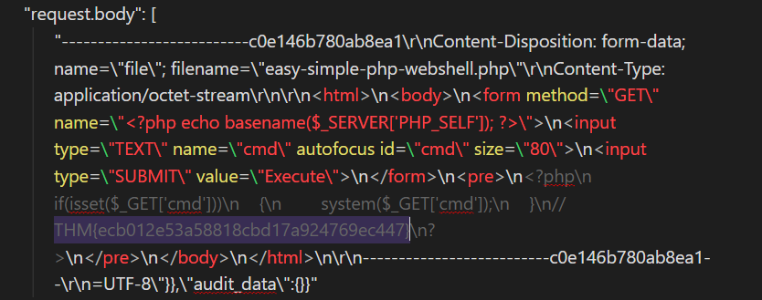
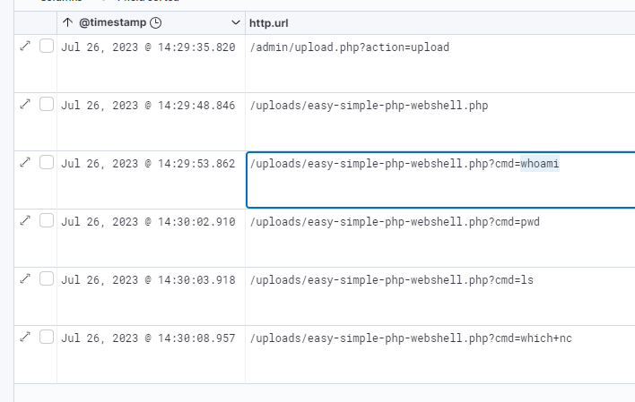

### Task 1  Scenario

Slingway Inc., a leading toy company, has recently noticed suspicious activity on its e-commerce web server and potential modifications to its database. To investigate the suspicious activity, they've hired you as a SOC Analyst to look into the web server logs and uncover any instances of malicious activity.

To aid in your investigation, you've received an Elastic Stack instance containing logs from the suspected attack. Below, you'll find credentials to access the Kibana dashboard. Slingway's IT staff mentioned that the suspicious activity started on **July 26, 2023**.

By investigating and answering the questions below, we can create a timeline of events to lead the incident response activity. This will also allow us to present concise and confident findings that answer questions such as:

- What vulnerabilities did the attacker exploit on the web server?
- What user accounts were compromised?
- What data was exfiltrated from the server?

#### Answer the questions below

What was the attacker's IP?

Look at remote addresses with http response 401 for anyone trying to access unauthorized pages, we only get 10.0.2.15.

Ans: 10.0.2.15


What was the first scanner that the attacker ran against the web server?  

Filter 10.0.2.15 events from old-new. Scanning the top events there are entires with User-Agent we see Nmap Scripting Engine. Nmap is a known tool used for discovering hosts and services on a network.


Ans: Nmap Scripting Engine

What was the User Agent of the directory enumeration tool that the attacker used on the web server?



Ans: Mozilla/5.0 (Gobuster)

In total, how many requested resources on the web server did the attacker fail to find?  

Look at 404 responses in response.status


Ans: 1867

What is the flag under the interesting directory the attacker found?  

We can look at response.status 200 and scan through the request_line or search the word flag.



Ans: a76637b62ea99acda12f5859313f539a 

What login page did the attacker discover using the directory enumeration tool?  

We can use the interesting fields to look for the login page.



Ans: /admin-login.php

What was the user agent of the brute-force tool that the attacker used on the admin panel?

Filter /admin-login.php then look at the User-Agent field.



Ans: Mozilla/4.0 (Hydra)


What username:password combination did the attacker use to gain access to the admin page?

Filter /admin-login.php with response 200. Looking at the events there is a field there request.headers.Authorization. Decode the base64 string in the field. (I've used [Cyberchef](https://gchq.github.io/CyberChef/) )



Ans: admin:thx1138

What flag was included in the file that the attacker uploaded from the admin directory?  
Since the attacker uploaded a file, we can look at PUT requests. Rightaway there is a filename in one of the event's request.body. Scan the event further and we can see the contents of the file.



Ans: THM{ecb012e53a58818cbd17a924769ec447}

What was the first command the attacker ran on the web shell?  

Filter all webshell events with ```transaction.remote_address : "10.0.2.15" and webshell.*```. Select http.url then sort events by old-new.



Ans: whoami

What file location on the web server did the attacker extract database credentials from using **Local File Inclusion**?  

FIlter php events then scan the http.url field


Ans: /etc/phpmyadmin/config-db.php

What **directory** did the attacker use to access the database manager?  

Ans: /phpmyadmin

What was the name of the database that the attacker **exported**?  


Ans: customer_credit_cards

What flag does the attacker **insert** into the database?

Filter SQL events and select the request.body field. There is only one event that inserts into the database. Scanning the sql query shows the flag.


Ans: c6aa3215a7d519eeb40a660f3b76e64c

# Task 2  Conclusion

After completing the log investigation, you can present confident findings that an attacker compromised the web server and database. You managed to follow the timeline of events, allowing for a clearer understanding of the incident and actions performed.

In response to this incident, Slingway Inc. should address the identified vulnerabilities promptly to enhance the security of its web server. Furthermore, the company should take appropriate steps to notify affected customers about the data breach and implement proactive security measures to mitigate future attacks.

Your investigation's comprehensive findings and actionable insights will enable Slingway Inc. to mitigate the damage caused by the compromised server, bolster its cyber security posture, and safeguard its customers' trust. Well done!