Conducting basic open source intelligence research on a website
# Task 1  When A Website Does Not Exist

What's the first thing you do when you are given the name of a business to check out? Fire up the ol' web browser, find the website and check it out, right?  

What if the website, or even the entire business, no longer exists?

That does NOT mean it's the end of the road.  

OSINT researchers may still be able to connect the dots and find useful information on such organizations.

Your job is to find as much information as you can about the website RepublicofKoffee.com.

``<Spoiler alert>`` the website doesn't exist, and if it does by the time you read this, the website in its current form is not our target.

One way to collect information about a website without directly visiting it is to simply do a search for it.

**Note:** Sometimes plugging a website into the search bar will send you directly to the site. Avoid this by putting the site in quote marks. Also note that this will only return results where the full domain name is written out on the website.

Go ahead and google "RepublicOfKoffee.com" with and without quote marks, just to see what happens.

# Task 2  Whois Registration

Just because nothing shows up when you visit 'RepublicOfKoffee.com,' doesn't mean that someone doesn't own the domain. In fact, if there is any kind of landing page at all, even a spammy one, then you can be sure that someone does, in fact, own it. But is it currently owned by the same person that used it for the time period we are interested in? We may or may not be able to figure that out, but it's worth a look.

We can confirm current registration status with a whois lookup.

A 'whois' lookup is the most basic form of domain recon available. There are multiple websites that will do it for you as well.

Personally, I recommend just going directly to [lookup.icann.org](https://lookup.icann.org/lookup). This should tell you the current hosting company used and name servers. Looking at the raw data option will show further details.

We're looking for any data we might be able to use as pivot points. Maybe an email address? Or better yet, a physical address or phone number?

**_Technically_** these are required in order to register any domain, but most domain registrars offer some kind of privacy protection for a trivial fee, if not free.

Anyway, let's see what we can find out!

#### Answer the questions below

What is the name of the company the domain was registered with?

Ans: NAMECHEAP INC


What phone number is listed for the registration company? (do not include country code or special characters/spaces)

Ans: 6613102107

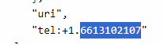

What is the first nameserver listed for the site?

Ans: NS1.BRAINYDNS.COM

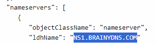

What is listed for the name of the registrant?

Ans: Redacted for Privacy

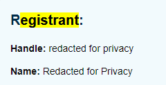

What country is listed for the registrant?

Ans: Panama
The current registrant is located in Iceland however it is not the answer, after looking up the question, the accepted answer is Panama. The question needs to be updated. 

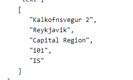

# Task 3  Ghosts of Websites Past

Don't be discouraged when your initial searches on a website turn up empty.

That's where Archive.org and the Internet Wayback Machine come into play.

Do yourself a favor and install the archive.org browser extension that will automatically pull up an option to search for a site on the Wayback Machine when it fails to load in the web browser.

Either with the browser extension, or just by going to archive.org and searching for it, see what snapshots are available of our target domain, RepublicOfKoffee.com.

Looking at the historical information available for the site, you should be able to answer the following questions without too much trouble.

#### Answer the questions below

What is the first name of the blog's author?

Find the first capture of the link. Open one article and the name should be there.

Ans: Steve

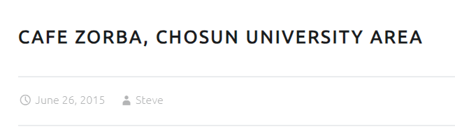

What city and country was the author writing from?

On the same page, there are tags at the end of the article. Of the tags is gwangju which sounds like a place.


Searching it on Google reveals the Gwangju is indeed a place on South Korea.

Other clues can be seen on the list of articles.
- Chosun University
- Bongsongdon
- Jeju Island
- KDJ Convention Center


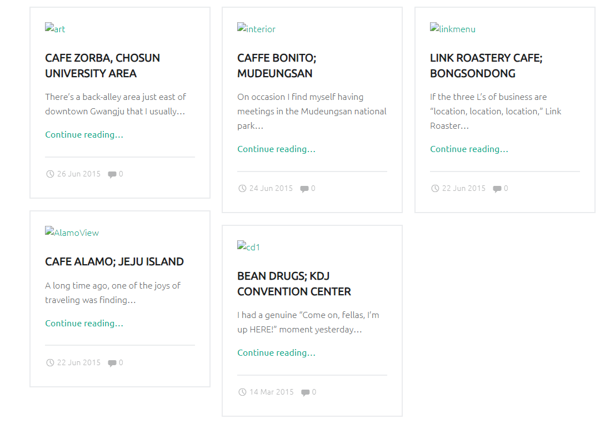
Ans: Gwangju, South Korea

[Research] What is the name (in English) of the temple inside the National Park the author frequently visits?

After skimming through he's articles, I found that he goes to Mudeungsan national park however, the name of the temple isn't in the article. Googling the park shows the name of the temple.


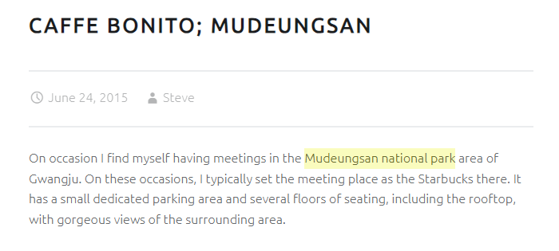

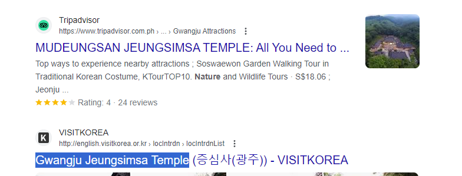
# Task 4  Digging into DNS

So far we've gathered some good info about the content that was on our target website, even though it hasn't been live for several years.

But what about technical details?

That's where ViewDNS.info comes in.

ViewDNS.info provides a convenient UI for looking up registration information on a target website. Using this information, it may be possible to draw certain conclusions that are not clearly spelled out, such as whether the website is hosted on a shared or dedicated IP address. The answer to this question can imply things about the website's budget as well as traffic.

Take a look at the search options available and see if you can answer these questions.

#### Answer the questions below

What was RepublicOfKoffee.com's IP address as of October 2016?

Use the IP History tool


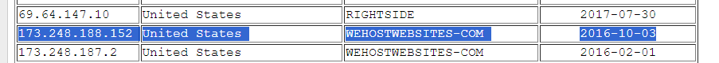

Based on the other domains hosted on the same IP address, what kind of hosting service can we safely assume our target uses?

Ans: shared

I'm not really familiar with hosting options so had to look it up.

How many times has the IP address changed in the history of the domain?

Since the room is already 2 years old. There's been a lot of changes to the IP. I had to look it up.

Ans: 4


# Task 5  Taking Off The Training Wheels
Congratulations on making it this far.

You'll need all of the skills you've learned so far for this task.

All I have for you, is a domain:

**heat[dot]net**

Good luck!

#### Answer the questions below

What is the second nameserver listed for the domain?

Ans: NS2.HEAT.NET

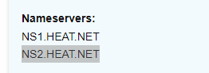

What IP address was the domain listed on as of December 2011?

Ans: 72.52.192.240

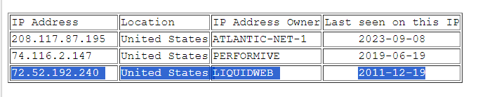

Based on domains that share the same IP, what kind of hosting service is the domain owner using?

Ans: Shared
There were no domains at the time of answering, so basing off the clue, I answered shared.


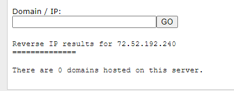

On what date did was the site first captured by the internet archive? (MM/DD/YY format)

Ans: 06/01/97

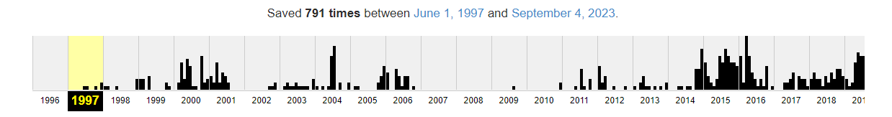

What is the first sentence of the first body paragraph from the final capture of 2001?

Ans: After years of great online gaming, it’s time to say good-bye.

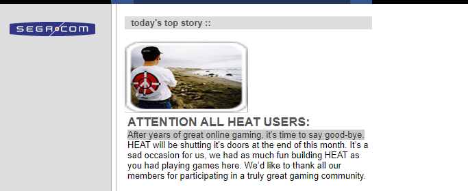

Using your search engine skills, what was the name of the company that was responsible for the original version of the site? 

Ans: Segasoft

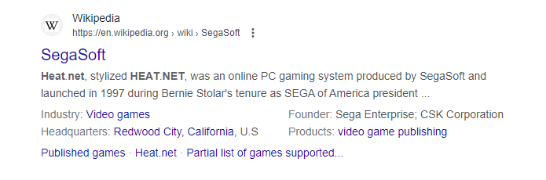

What does the first header on the site on the last capture of 2010 say?

Ans: Heat.net – Heating and Cooling

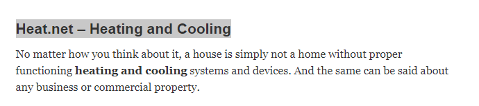
# Task 6  Taking A Peek Under The Hood Of A Website

Isn't it kind of interesting how the website disappeared for a period of time and came back?

Clearly the purpose of the site is different now. Let's roll up our sleeves and figure out what's going on.

First, do you have any gut feelings about this site? What is your overall impression? Does it _feel_ like a legitimate source of information?

Why?

You might consider some of the following points:

- Language - What grade level is the writing? Does it seem to be written by a native English speaker?
- UX - Is it user friendly? Is the design modern?
- What pages does the site have?

I can tell you that this website conforms well to antiquated search engine optimization (SEO) best practices. You can read more about [SEO best practices on ahrefs](https://ahrefs.com/blog/seo-best-practices/) if you like before you continue.

**Technical Research**

Often, clues about a website and its creator/owner may be unintentionally left behind in the source code of the website. Pretty much every web browser will have a method of doing this. It is well worth taking the time to become acquainted with how this works in your browser of choice. For Chrome on MacOS, you'll go to the top menu bar and choose View > Developer > View Source.

**_Note: This also works on sites you visit within Archive.org's Wayback Machine._**

Once the source code of the page loads, it's time to look around. You don't have to understand HTML, CSS, or Javascript to read notes that the developers left behind for themselves. In HTML, comments begin with the characters <!--. Here's an example of what a forgotten comment might look like in practice:

`<!--Don't forget to email Bob Loblaw when the site goes live at bob@fakeemail.com-->`

As easy as that may be to read, if it was buried inside a gigantic page full of code it could still be easy to miss. That's where ctrl-F comes in. Here are some good things to search for with ctrl-f:

|   |   |   |
|---|---|---|
|Search Term|Explanation|More information|
|<\!--|Comments|See above|
|@|email addresses|[Pivoting from an Email address](https://nixintel.info/osint/12-osint-resources-for-e-mail-addresses/)|
|ca-pub|Google Publisher ID|[Google's Description](https://support.google.com/adsense/answer/105516?hl=en)|
|ua-|Google AdSense ID|[Bellingcat Tutorial](https://www.bellingcat.com/resources/how-tos/2015/07/23/unveiling-hidden-connections-with-google-analytics-ids/)|
|.jpg|Also try other image file extensions|Likely to reveal more directory structure|

Finding any of the above data gives you a potential pivot point. The Bellingcat article linked above goes into more detail on how exactly to do it but you don't have to overcomplicate things!

You can always just take any of the above information and plug it back into your favorite search engine and you may just strike gold!

Ready to put this all into practice? 

These following questions refer to heat[dot]net/36/need-to-hire-a-commercial-heating-contractor/

Have at it!

#### Answer the questions below

How many internal links are in the text of the article?

Ans: 5
```
http://www.heat.net/39/save-money-on-your-commercial-heating-bill/
http://www.heat.net/36/need-to-hire-a-commercial-heating-contractor/
http://www.heat.net/32/how-do-heating-and-cooling-systems-work/
http://www.heat.net/
http://www.heat.net/15/cutting-your-heating-costs-without-emptying-your-wallet/
```

How many external links are in the text of the article?

Ans: 1
`http://www.purchase.org/`

Website in the article's only external link ( that isn't an ad)

Ans: purchase.org

Try to find the Google Analytics code linked to the site

Ans: UA-251372-24

Is the the Google Analytics code in use on another website? Yay or nay

Ans: nay

Does the link to this website have any obvious affiliate codes embedded with it? Yay or Nay

Ans: nay

# Task 7  Final Exam: Connect the Dots

Experienced OSINT researchers will tell you that chasing rabbit holes all day and night without being able to make some solid connections is not OSINT.

OSINT refers to the patterns that start to emerge as we connect the dots in the analysis of the data. 

Congrats! you found that our target, heat[.]net, links to an interesting external site. A question remains though: **_Why???_**

There is no affiliate code in the link, so there is no obvious financial connection between the two. Maybe there's another kind of connection.

This is your final exam, and there is exactly one question.

Get busy!

Use the tools in Task 4 to confirm the link between the two sites. Try hard to figure it out without the hint.

For my initial move, I looked at the IP History of both web sites. 

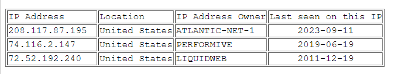
heat.net IP History

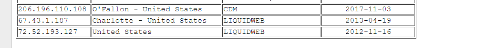
purchase.org IP History

Both used to be owned by LIQUIDWEB, however it does not match the given clue in the answer, and I wasn't sure where to look next. I tried using WHOIS but it didn't really help me. Looking at an online writeup apparently it is liquidweb but written differently. The correct answer is liquid web, l.l.c

Ans: liquid web, l.l.c

# Task 8  Debriefing

Congratulations on completing the challenge! In fact, it is highly probable that both of these sites are owned and operated by the same entity.

Let's unpack this.

Although there are loads of advertisements on our target website, that is probably a tiny percentage of the money this site makes.

It would require further investigation to confirm this but it's a good bet that the creators of these two sites make most of their money by functioning as what's called a private blog network (PBN). PBNs exist for one purpose: to convince the search engine algorithms that another site should rank higher in the search engine results.

Modern search engines work by mapping the internet by its links. This gets extremely complicated very quickly, but as a generalization they work on a few assumptions:

1. How well a site answers users' questions on a topic can be evaluated by the incoming, outgoing, and internal links it has. The presence of a lot of links **_to_** website A **_from_** websites B, C, D, and E is taken as a sign that website A is authoritative on the topic. Outgoing links are treated a little differently. Too many outgoing links can _hurt_ a site's ranking, but search engines also assume that a website with too _few_ outgoing links is probably not answering users' questions very well either.
2. How authoritative the websites are that are sending and receiving links. If your site gets plugged in a New York Times article, that will earn far more ‘Google juice’ than a plug on CedarHillsHomeownersAssociation.xyz.
3. Relevance of the incoming links to a site. A link to a site from top tier websites like the New York Times is always going to be a very good thing. Almost as good, though, would be a link from a reputable website dedicated to the same topic as yours. The relevance of the language used in the hyperlink itself is also an important part of this consideration.

Let's say we are creating a new website. In order to get some SEO juice flowing to it, we'll need to get another website to start linking to our site as fast as possible. A common (white hat) method of doing this would be volunteering to write free blog articles on other websites in exchange for links back to your site.

As you can imagine, this takes a lot of time. It is a long term endeavor that could take six months or so to see results, depending on how much competition there is for the keywords you are targeting.

Thinking like a hacker here, what's a good way to give your new website (called 'money site') a faster boost in the search engine rankings? Highlight the below section once you have an idea in your head.

By setting up a separate website that is completely under your control and exists for the sole purpose of telling search engines that your main site should rank higher in searches than it rightfully deserves.

That's right, heat[.]net, in its current form is probably not designed for human eyes at all. It is designed primarily to trick the search engines into placing purchase[.]org higher in the search results than it would have otherwise.

Purchase[.]org appears to be a drop shipping e-commerce site, which probably earns its owner substantially more money than heat[.]net. It needs that sweet sweet SEO juice to push it up the search engine results pages (AKA SERPs) though.

**Is all of this ethical?** Good question. Google, for one, would clearly define this practice as black hat and is constantly trying to improve its algorithms to penalize sites that do this kind of thing. As of this writing, though, it is not illegal.

**Is the site a scam?** It is worth considering how much time and effort that goes into setting up a PBN. A PBN ideally has a minimum of 50 pages of unique, natural-sounding and on-topic articles. That's a lot of time and effort that went into getting a fast, short-term bump in the rankings, rather than into other aspects of the business, or even something as simple and affordable as pay-per-click marketing.

On the other hand, you might be surprised to learn just how common it is for websites to hire SEO agencies. Some of these agencies, whether they admit it or not, have hundreds of PBNs and a staff of writers (usually offshore) pumping out content designed solely for the consumption of the search algorithms.

# Task 9  Wrap-up

A little web OSINT knowledge can go a long way in online investigations. A few examples of where it comes into play include any kind of business OSINT, online scams, or even political journalism. If you would like to see a prime example of this kind of research being put into practice, I highly recommend checking out NixIntel's expose [linking antifa.com to Russia](https://nixintel.info/osint/website-osint-whats-the-link-between-antifa-com-and-russia/), which is an amazing case study.

Make sure to check out the other OSINT boxes out there such as:

- The [Searchlight IMINT Room](https://tryhackme.com/room/searchlightosint) and [Geolocation](https://tryhackme.com/room/geolocatingimages) for Geolocation and Image Analysis
- The [Google Dork](https://tryhackme.com/room/googledorking) room for advanced search engine operators
- The [OhSINT](https://tryhackme.com/room/ohsint) room for a little extra IMINT practice

There are also two fantastic podcasts that every OSINT practitioner should regularly listen to. The [OSINT Curious](https://osintcurio.us/) podcast and [The Privacy, Security, & OSINT Show](https://inteltechniques.com/podcast.html). 

Finally, a solid paid option for OSINT training that won't break the bank is [TheOSINTion](https://www.theosintion.com/). If you enjoyed the content of this room you would LOVE the [Business OSINT](https://www.theosintion.com/courses/business-osint/) course they offer. I have no affiliation with the course other than being a satisfied customer.