<!--  -->

Eric Fischer from the Purchasing Department at Bartell Ltd has received an email from a known contact with a Word document attachment.  Upon opening the document, he accidentally clicked on "Enable Content."  The SOC Department immediately received an alert from the endpoint agent that Eric's workstation was making suspicious connections outbound. The pcap was retrieved from the network sensor and handed to you for analysis. 

**Task**: Investigate the packet capture and uncover the malicious activities. 

*Credit goes to [Brad Duncan](https://www.malware-traffic-analysis.net/) for capturing the traffic and sharing the pcap packet capture with InfoSec community. 

NOTE: DO NOT directly interact with any domains and IP addresses in this challenge. 

---

<!--Deploy the machine attached to this task; it will be visible in the split-screen view once it is ready.

If you don't see a virtual machine load, then click the Show Split View button.

 

Are you ready for the journey?

Please, load the pcap file in your Analysis folder on the Desktop into Wireshark to answer the questions below. -->

#### Answer the questions below
What was the date and time for the first HTTP connection to the malicious IP?

(**answer format**: yyyy-mm-dd hh:mm:ss)

Filter out http packets check the first packet on the search result
packet 1735 then check the frame tab for the date

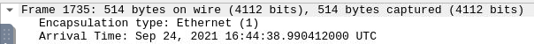

Ans: 2021-09-24 16:44:06

What is the name of the zip file that was downloaded?  

Answer can be seen under the info column

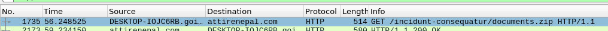

Ans: documents.zip

What was the domain hosting the malicious zip file?  

Enabling resolve name resolutions helps with this one

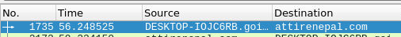

another way to get this one is to follow the http stream

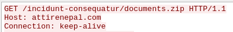

Ans: attirenepal.com

Without downloading the file, what is the name of the file in the zip file?  

Follow the http stream, you can see and .xls file in the start and end of the data section

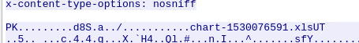

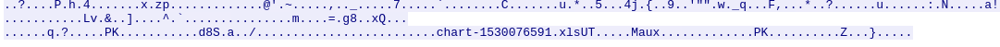

Ans: chart-1530076591.xls

What is the name of the webserver of the malicious IP from which the zip file was downloaded?  

In packet 2173 under the http section, there is a server listed

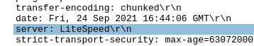

Ans: LiteSpeed

What is the version of the webserver from the previous question?  

Answer is under x-powered-by

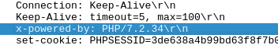

Ans: PHP/7.2.34

Malicious files were downloaded to the victim host from multiple domains. What were the three domains involved with this activity?

For this one, I had no clue with how to get this. I used Virustotal to see if I can get any but to no avail. I decided to look up a guide inorder to get this one.

According to the THM hint, Check HTTPS traffic. Narrow down the timeframe from 16:45:11 to 16:45:30.

tcp.port == 443 && (frame.time >= "Sep 24, 2021 16:45:11") && (frame.time <= "Sep 24, 2021 16:45:30")

then follow the tcp stream, find CLIENT HELLO in the info column

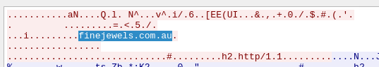

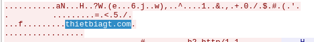

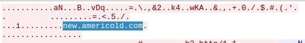

tcp.stream eq 90, tcp.stream eq 97 and tcp.stream eq 98

Ans: finejewels.com.au, thietbiagt.com, new.americold.com

Which certificate authority issued the SSL certificate to the first domain from the previous question?  

Return to the stream of the first url, stream 90

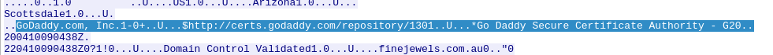

Ans: GoDaddy

What are the two IP addresses of the Cobalt Strike servers? Use VirusTotal (the Community tab) to confirm if IPs are identified as Cobalt Strike C2 servers. (answer format: enter the IP addresses in sequential order)

Hint: Check the Conversations menu option

Go to Statistics > Conversations > TCP then filter by packets in descending order

Cobalt Strike uses ports 80 and 8080, so look for IPs that used these port

185.125.204.174

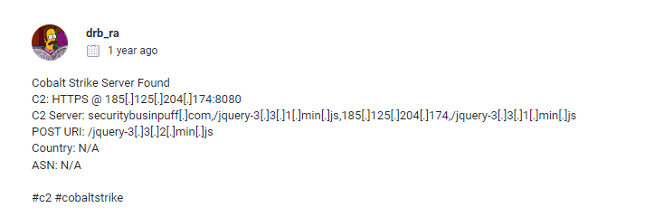

185.106.96.158

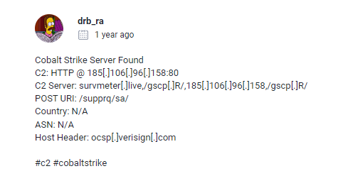

Ans: 185.106.96.158, 185.125.204.174

What is the Host header for the first Cobalt Strike IP address from the previous question?  

Filter ip.src == 185.106.96.158 then follow the stream

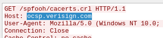

Ans: ocsp.verisign.com

What is the domain name for the first IP address of the Cobalt Strike server? You may use VirusTotal to confirm if it's the Cobalt Strike server (check the Community tab).

From the same filter as the previous question, we can see survmeter.live, we can confirm that this is the domain name in the community section of the virustotal report.

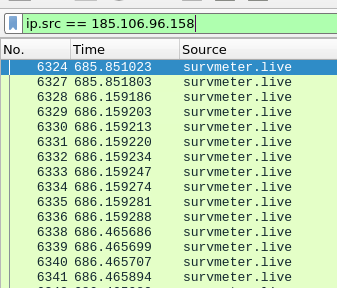

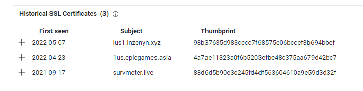

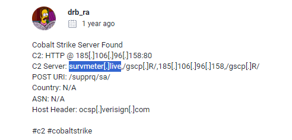

Ans: survmeter.live

What is the domain name of the second Cobalt Strike server IP?  You may use VirusTotal to confirm if it's the Cobalt Strike server (check the Community tab).

Same process as the previous question

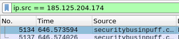

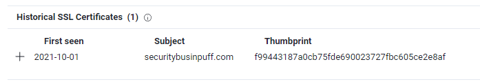

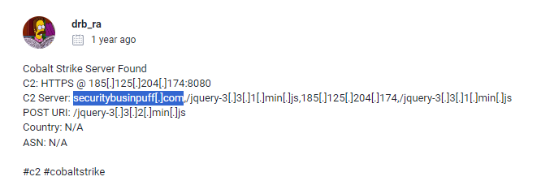

securitybusinpuff.com

What is the domain name of the post-infection traffic?

Hint: Filter Post HTTP traffic

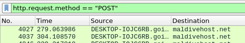

Ans: maldivehost.net

What are the first eleven characters that the victim host sends out to the malicious domain involved in the post-infection traffic? 

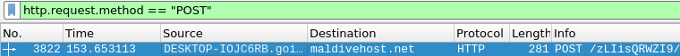

Ans: zLIisQRWZI9

What was the length for the first packet sent out to the C2 server?

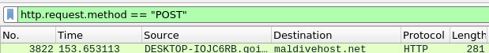

Ans: 281

What was the Server header for the malicious domain from the previous question?

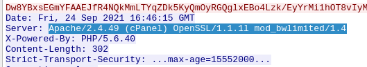

Ans: Apache/2.4.49 (cPanel) OpenSSL/1.1.1l mod_bwlimited/1.4

The malware used an API to check for the IP address of the victim’s machine. What was the date and time when the DNS query for the IP check domain occurred? (**answer format**: yyyy-mm-dd hh:mm:ss UTC)

I filtered dns but didn't know how to proceed, so I had to look up the same guide as before. Sort the requests from oldest to newest

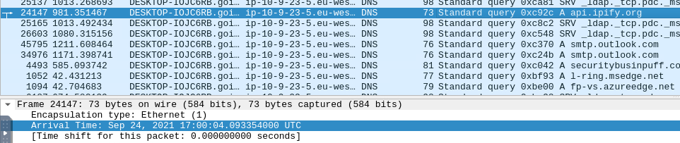

This is the first api result

Ans: 2021-09-24 17:00:04 UTC

What was the domain in the DNS query from the previous question?

Ans: api.ipify.org

Looks like there was some malicious spam (malspam) activity going on. What was the first MAIL FROM address observed in the traffic?

Filter smtp, there is a message there saying that SMTP service is disabled, this feels suspicious. Follow the tcp stream.

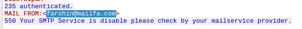

Ans: farshin@mailfa.com

How many packets were observed for the SMTP traffic?

Filter smtp
`smtp`

Ans: 1439