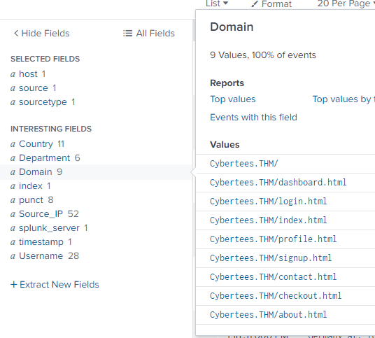
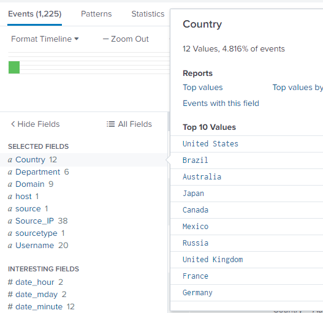
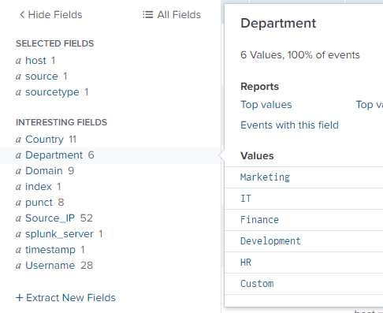
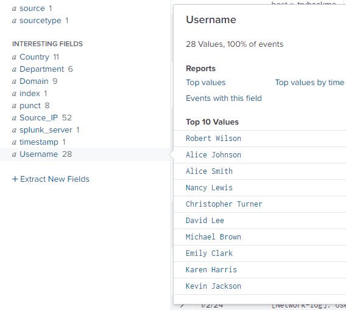
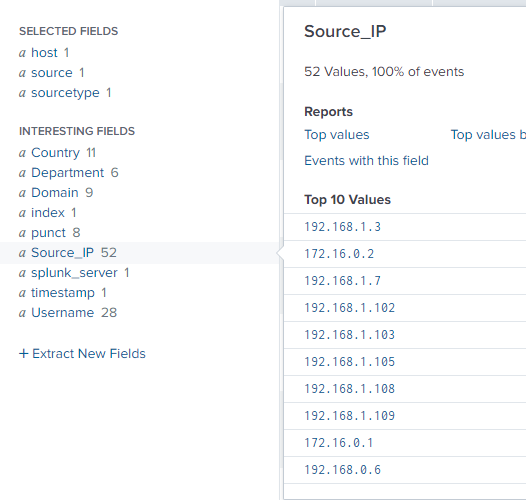
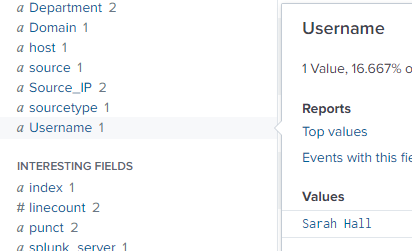

Fix the log parsing issue and analyze the logs in Splunk.
# Task 1  FIXIT Challenge

In this challenge room, you will act as John, who has recently cleared his third screening interview for the SOC-L2 position at MSSP Cybertees Ltd, and a final challenge is ready to test your knowledge, where you will be required to apply the knowledge to FIX the problems in Splunk.  
You are presented with a Splunk Instance and the network logs being ingested from an unknown device.

Pre-requisites  
This challenge is based on the knowledge covered in the following rooms:

- [Regex](https://tryhackme.com/room/catregex)
- [Splunk: Exploring SPL](https://tryhackme.com/room/splunkexploringspl)
- [Splunk: Data Manipulation](http://tryhackme.com/jr/splunkdatamanipulation)

Room Machine  
Before moving forward, start the lab by clicking the `Start Machine` button. The lab will be accessible via split screen. If the VM is not visible, use the blue Show Split View button at the top-right of the page. Once the VM is in split screen view, you can click the `+` button to show it on a full screen. The VM will take 3-5 minutes to load properly. In this room, we will be working using the terminal of the VM and accessing the Splunk instance at `MACHINE_IP:8000`.

**Note:** Splunk is installed in the `/opt/splunk` directory, and you will be working in the App called Fixit.  
  
Challenge: FIXIT  
This challenge is divided into three levels:

#### Level 1: Fix Event Boundaries

Fix the Event Boundaries in Splunk. As the image below shows, Splunk cannot determine the Event boundaries, as the events are coming from an unknown device.


#### Level 2: Extract Custom Fields

Once the event boundaries are defined, it is time to extract the custom fields to make the events searchable.  

- Username
- Country
- Source_IP
- Department
- Domain

**Sample Logs:**  
To create regex patterns, sample Network logs are shown below:

```c
[Network-log]: User named Johny Bil from Development department accessed the resource Cybertees.THM/about.html from the source IP 192.168.0.1 and country 
Japan at: Thu Sep 28 00:13:46 2023
[Network-log]: User named Johny Bil from Marketing department accessed the resource Cybertees.THM/about.html from the source IP 192.168.2.2 and country 
Japan at: Thu Sep 28 00:13:46 2023
[Network-log]: User named Johny Bil from HR department accessed the resource Cybertees.THM/about.html from the source IP 10.0.0.3 and country 
Japan at: Thu Sep 28 00:13:46 2023
```

Level 3: Perform Analysis on the FIXED Events  
Once the custom fields are parsed, we can use those fields to analyze the Event logs. Examine the events and answer the questions.

Happy Fixing!

```
- (1) Username .+named\s(\S+\s\S+)
- (5) Country .+country\s+(\w+)
- (4) Source_IP .+\s((\d{1,3}\.){3}\d{1,3})
- (2) Department .\w+\s(\w+)
- (3) Domain (\s\w+){4}\s([a-zA-Z0-9]+\.\w+\/(\w+\.\w+)?)

final regex
.+named\s(\S+\s\S+).\w+\s(\w+)(\s\w+){4}\s([a-zA-Z0-9]+\.\w+\/(\w+\.\w+)?).+\s((\d{1,3}\.){3}\d{1,3}).+country\s+(\w+)
```

Files to be modified/created:
```
/default/props.conf -> event boundary
/default/transforms.conf -> regex
/default/fields.conf
```

Restart splunk after every change.

```
/opt/splunk/bin/splunk restart
```

```props.conf
[network_logs]
SHOULD_LINEMERGE = true
BREAK_ONLY_BEFORE = \[Network-log\]
TRANSFORM-network = network_custom_fields
```

```transforms.conf
[network_custom_fields]
REGEX = .+named\s(\S+\s\S+).\w+\s(\w+)(\s\w+){4}\s([a-zA-Z0-9]+\.\w+\/(\w+\.\w+)?).+\s((\d{1,3}\.){3}\d{1,3}).+country\s+(\w+(\s\w+)?) at:
FORMAT = Username::$1 Department::$2 Domain::$4 Source_IP::$6 Country::$8
WRITE_META = true
```

```fields.conf
[Username]
INDEXED = true

[Department]
INDEXED = true

[Domain]
INDEXED = true

[Source_IP]
INDEXED = true

[Country ]
INDEXED = true
```

## Answer the questions below

What is the full path of the FIXIT app directory?  

```
/opt/splunk/etc/apps/fixit
```

What Stanza will we use to define Event Boundary in this multi-line Event case?

Answer: BREAK_ONLY_AFTER

In the inputs.conf, what is the full path of the network-logs script?  

```
/opt/splunk/etc/apps/fixit/bin/network-logs
```

What regex pattern will help us define the Event's start?

```
\[Network-log\]
```

What is the captured domain?



Answer: Cybertees.THM

How many countries are captured in the logs?

Answer: 12

I modified my regex to consider countries with two words. I was waiting for a while as I was stuck on 11 then I noticed that there were entries for United Kingdom, United States, and South Africa but would show as United and South.

I had to adjust my regex to capture one or two words and exclude at:
```
.+named\s(\S+\s\S+).\w+\s(\w+)(\s\w+){4}\s([a-zA-Z0-9]+\.\w+\/(\w+\.\w+)?).+\s((\d{1,3}\.){3}\d{1,3}).+country\s+(\w+(\s\w+)?) at:
```


How many departments are captured in the logs?  



Answer: 6

How many usernames are captured in the logs?



Answer: 28

How many source IPs are captured in the logs?



Answer: 52

Which configuration files were used to fix our problem? [Alphabetic order: File1, file2, file3]  

Answer: fields.conf, props.conf, transforms.conf

What are the TOP two countries the user Robert tried to access the domain from? [Answer in comma-separated and in Alphabetic Order][Format: Country1, Country2]  

```
index=main  Username="Robert Wilson" 
| stats count by Country
```

Answer: Canada, United States

Which user accessed the secret-document.pdf on the website?

```
index=main pdf
```



Answer: Sarah Hall